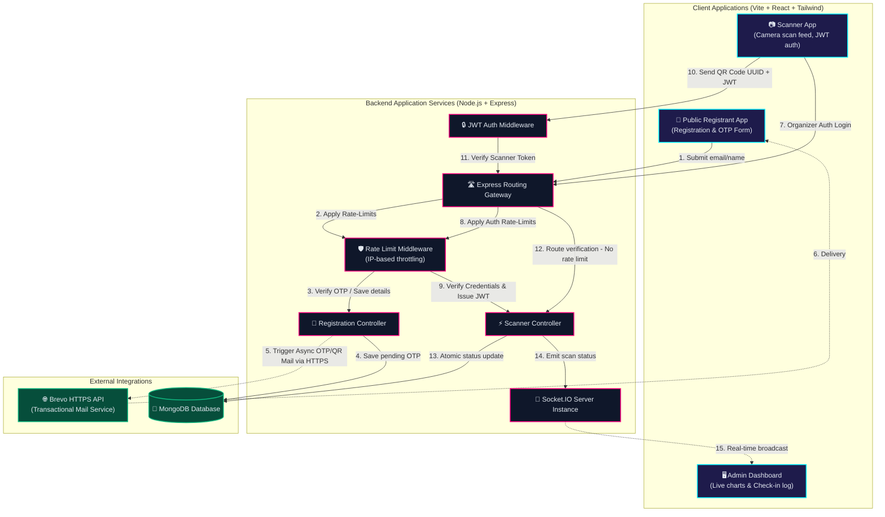
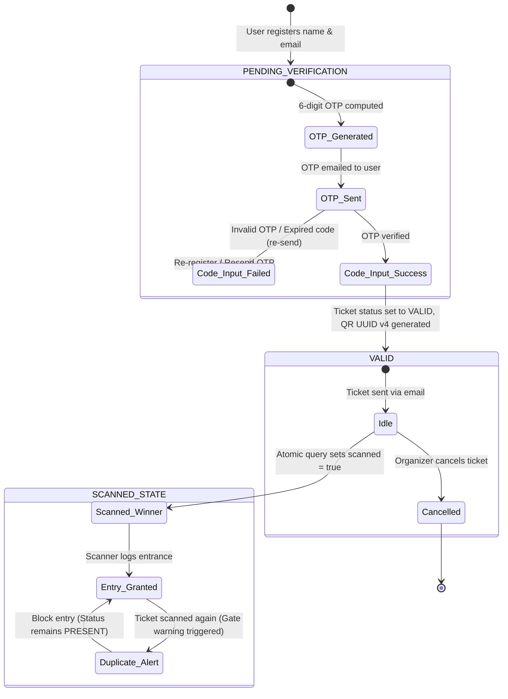
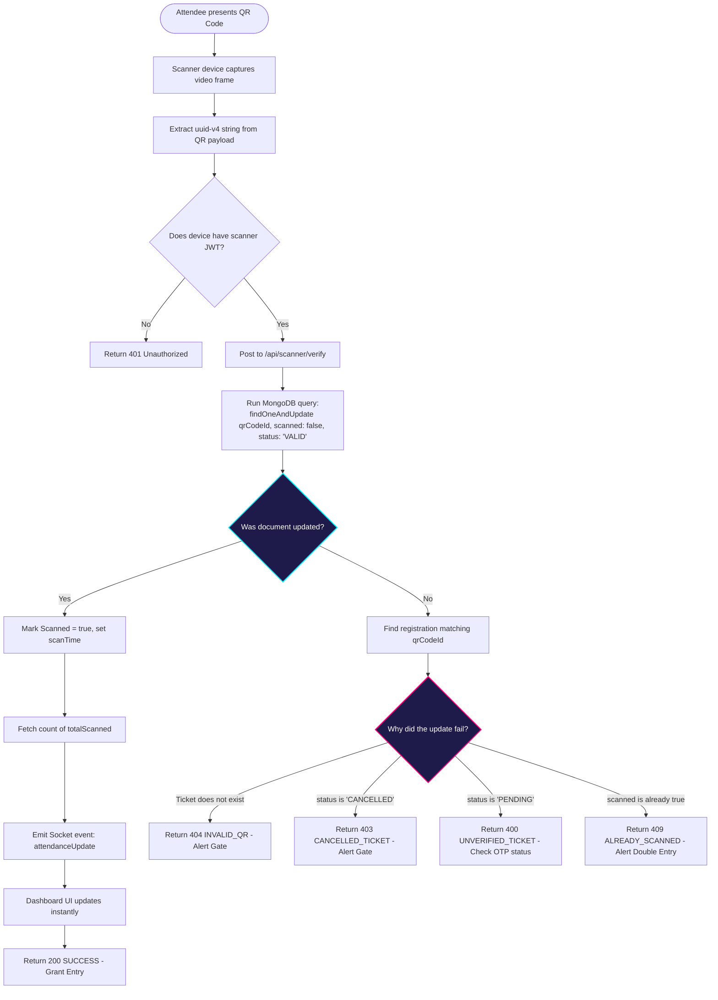
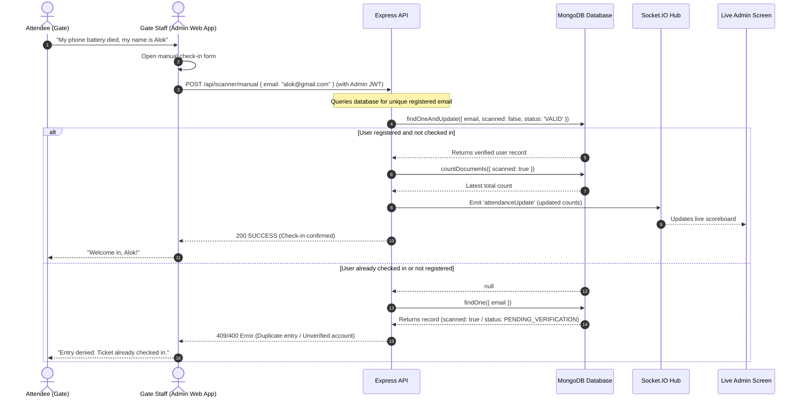
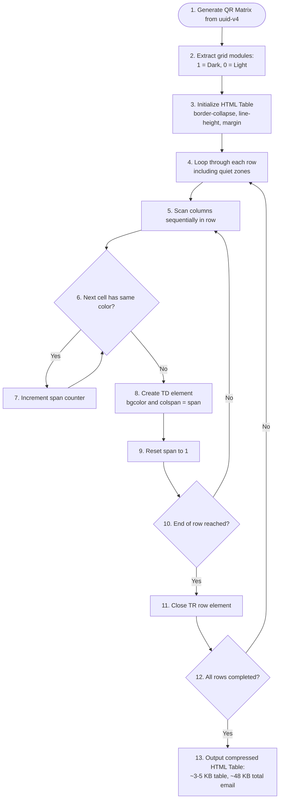

# 📊 Event Management System - Architecture Flow Diagrams

This document contains detailed visual flow diagrams illustrating the structural architecture, state machines, and real-time event updates of the QR-Based Event Attendance & Entry Verification System.

---

## 1. High-Level Component & Data Flow

This diagram illustrates how client applications interact with the backend APIs, the database, and third-party SMTP servers.

---

## 2. Ticket State Transition Flow

This state machine details how a registrant’s ticket moves from submission through email validation to successful entry verification.

---

## 3. Real-Time Gate Scan Loop

Shows the precise sequence of verification steps executed when an attendee arrives at the entry gate.

---

## 4. Manual Check-in Fallback Flow

Illustrates the fallback flow used when an attendee's screen is cracked or their device has no battery.

---

## 5. Inline HTML QR Table Generation with Run-Length Encoding (RLE)

This flowchart illustrates how raw QR matrix data is compressed into a lightweight HTML `<table>` representation using 1D Run-Length Encoding (RLE) to stay under the 102 KB Gmail clipping threshold.

